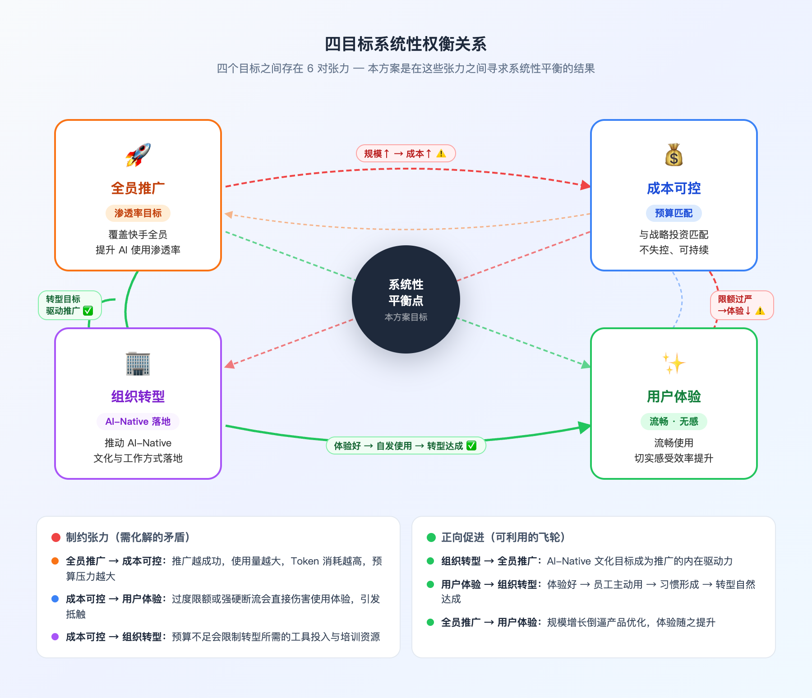
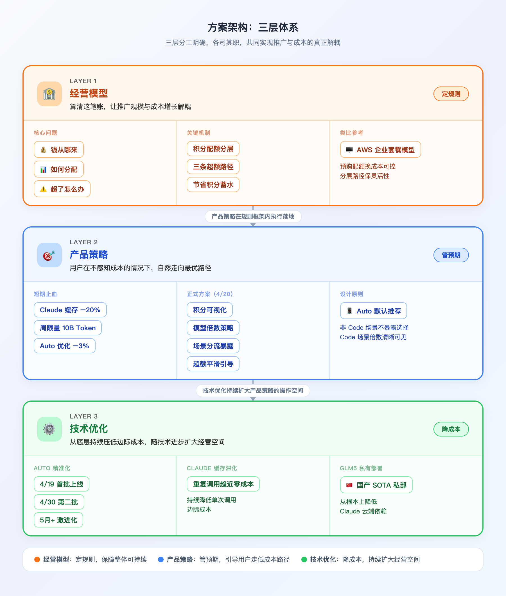
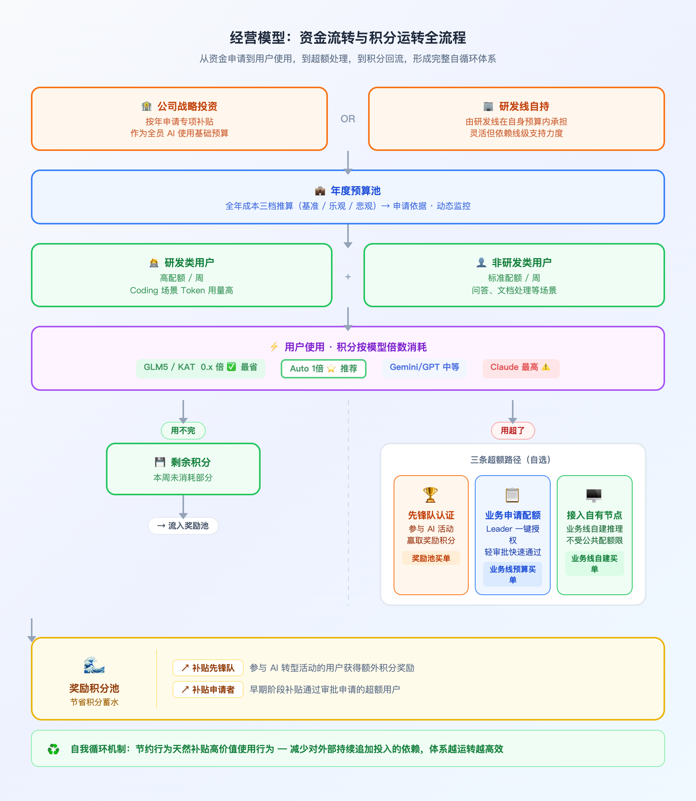
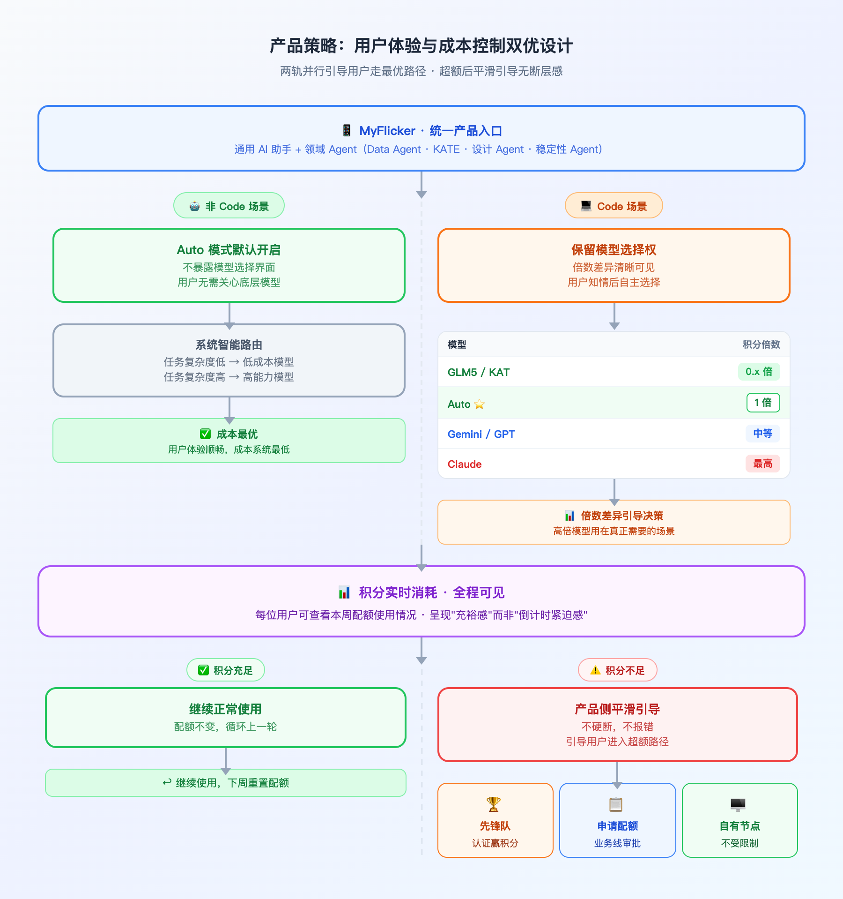
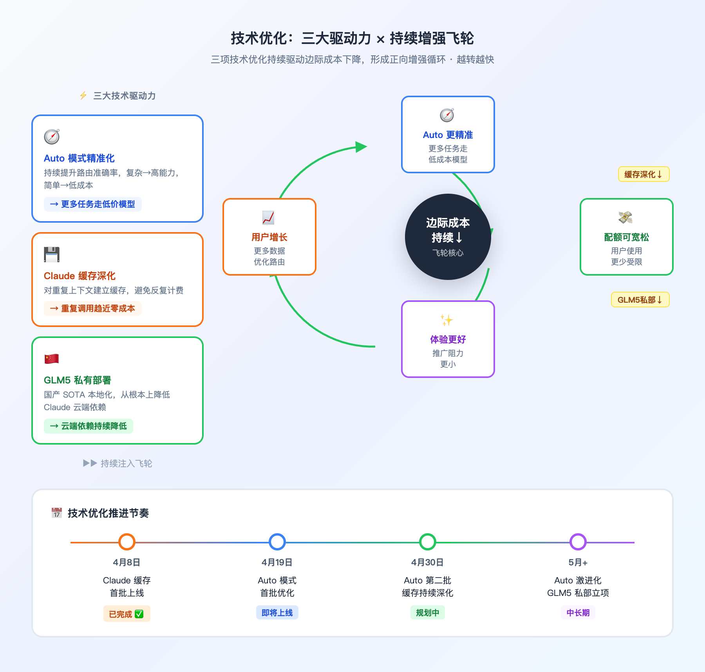

# 快手 AI 生产力业务经营方案

**覆盖全员、成本可控、体验优先、推动转型的系统性治理设计**

---

# 00 全文概览

**核心结论：推广与成本必须解耦——通过经营模型 + 产品策略 + 技术优化三层体系，实现用户增长与成本增长的分离。**

随着 MyFlicker 面向快手全员统一推广，若不建立治理机制，推广越成功、成本越高，项目将难以可持续运营。本方案在四个相互制约的目标之间寻求系统性平衡，以 AWS 企业套餐模型为类比框架，构建"分层激励 + 自我循环"的经营体系。

| 层级 | 核心问题 | 关键设计 |
|------|---------|---------|
| **经营模型** | 钱从哪来、如何分配、超了怎么办 | 积分配额 + 三条超额路径 + 节省蓄水 |
| **产品策略** | 如何让用户自然走低成本路径 | 短期止血 + 正式 Token 经济学（4月20日） |
| **技术优化** | 如何持续压低边际成本 | Auto 精准化 + Claude 缓存 + GLM5 私部 |

**3 大里程碑**：(1) 4月19日 Auto 首批优化上线；(2) 4月20日 MyFlicker 1.0 + Token 经济学正式上线；(3) 持续推进 GLM5 私有部署。

---

# 01 背景与核心矛盾

快手 AI 生产力体系正在整合为统一平台，覆盖以下产品线：

- **MyFlicker**：面向全员的 AI 工作助手（原 CodeFlicker + MyFlicker 合并）
- **领域 Agent 矩阵**：Data Agent、研发 Agent（KATE）、设计 Agent、稳定性 Agent

随着产品统一推广、用户规模持续增长，AI 使用成本面临结构性压力：

| 问题 | 具体表现 |
|------|---------|
| 成本随推广正相关 | Claude 等高价模型被无节制使用，周成本持续攀升 |
| 用户无感知 | 不知道自己在用多贵的模型，也不知道消耗了多少 |
| 无超额处理机制 | 积分用完后没有机制，要么卡死要么放任 |
| 缺乏组织激励绑定 | AI 工具使用与公司 AI 转型目标脱节 |

**若不建立治理机制，推广越成功、成本越高，项目将难以可持续运营。**

---

# 02 多目标权衡：系统性设计的出发点

本方案是在四个相互制约目标之间寻求系统性平衡的结果，而非单一目标的最大化。

| 目标 | 说明 | 核心张力 |
|------|------|---------|
| **🚀 全员推广** | 覆盖快手所有员工，提升 AI 使用渗透率 | 用户越多，成本越高 |
| **💰 成本可控** | 与公司战略投资规模匹配，不失控 | 过度限制会伤害体验与推广 |
| **✨ 用户体验** | 员工流畅使用，切实感受效率提升 | 配额与限制会制造摩擦 |
| **🏢 组织转型** | 以 AI 工具推动公司 AI-Native 文化落地 | 强制推广可能流于形式 |

**设计原则**：不以"限制"控成本，而以"分层激励"引导用户主动走低成本路径。类比 AWS 企业套餐模型——预购配额换成本可控，分层路径保灵活性，自动路由降使用门槛。

---

# 03 方案架构：三层体系

| 层级 | 目标 | 核心工具 |
|------|------|---------|
| **第一层：经营模型** | 算清这笔账，让推广规模与成本增长解耦 | 积分配额 + 超额路径 + 蓄水循环 |
| **第二层：产品策略** | 用户在不感知成本的情况下走最优路径 | 短期止血 + Token 经济学 |
| **第三层：技术优化** | 从底层持续压低边际成本，扩大经营空间 | Auto 精准化 + 缓存 + 私部 |

三层分工明确：**经营模型定规则、产品策略管预期、技术优化降成本**，三者共同作用，才能实现推广与成本的真正解耦。

---

# 04 第一层：经营模型

## 4.1 资金来源

| 路径 | 说明 |
|------|------|
| **路径一：公司战略投资** | 由项目团队向公司申请专项补贴，作为全员 AI 使用的基础预算保障 |
| **路径二：研发线自持** | 由研发线在自身预算内承担，灵活但依赖线级支持力度 |

> 🔲 **【待调研】行业对标**：字节、阿里、腾讯等大厂如何补贴内部员工 AI 工具使用？补贴模式、金额量级是多少？
>
> 🔲 **【待测算】历史成本基准**：当前每月实际 AI 使用成本是多少？按研发 / 非研发拆解后人均成本是多少？
>
> 🔲 **【待确认】资金来源路径**：战略投资 / 研发线自持 / 混合，需对齐管理层决策。

## 4.2 全年成本推算

以下推算为申请预算的核心依据，需在 4月20日前完成：

| 推算维度 | 说明 | 状态 |
|----------|------|------|
| **服务用户规模** | 全年预计覆盖人数及分阶段增长曲线 | 🔲 待填入 |
| **人均年度成本** | 研发类 / 非研发类人均年消耗分别测算 | 🔲 待测算 |
| **整体年度成本** | 全年总成本（基准 / 乐观 / 悲观三档） | 🔲 待测算 |
| **战略投资需求** | 扣除节省回流、业务线自费后，需申请多少？ | 🔲 待测算 |
| **ROI 估算** | 人效提升价值 vs AI 使用成本，ROI 如何量化？ | 🔲 待设计 |

## 4.3 人均积分配额分层

| 用户类型 | 配额等级 | 依据 |
|----------|---------|------|
| **研发类** | 高配额 | Coding 场景 Token 用量显著更高 |
| **非研发类** | 标准配额 | 日常问答、文档处理等场景 |

> 🔲 **【待设计】积分具体数值**：研发类 / 非研发类每周配额数值（4月20日上线前置条件）
>
> 🔲 **【待设计】积分周期规则**：每周重置 or 可结转？结转上限是多少？

## 4.4 超额的三条路径

| 路径 | 方式 | 资金来源 | 设计要点 |
|------|------|---------|---------|
| **🏆 路径 A：先锋队认证** | 参与公司 AI 组织转型活动 | 战略投资兜底（早期）+ 节省池（长期）| 工具使用与转型目标绑定 |
| **📋 路径 B：申请额外配额** | 个人向上级 / 业务线统一申报 | 业务线预算承担 | 轻审批，leader 一键授权 |
| **🖥 路径 C：自有节点接入** | 业务线接入自有推理节点 | 业务线自建 | 完整体验保留，不受配额限制 |

> 🔲 **【待设计】路径 A SOP**：哪些活动算、奖励多少积分、由谁认定、如何持续运营
>
> 🔲 **【待设计】路径 B 审批流**：走哪个系统、审批链路几级、多久给结论
>
> 🔲 **【待设计】白名单管控规则**：审批门槛、规模上限、定期复核周期

## 4.5 节省积分蓄水机制

节约行为天然补贴高价值使用行为，体系自我循环，减少对外部持续追加投入的依赖：

| 流转环节 | 说明 |
|---------|------|
| 用量低于配额 | 剩余积分不清零，流入奖励池 |
| 奖励池蓄水 | 积累后用于补贴先锋队 / 超额申请者 |
| 自我循环 | 节约者 → 补贴 → 高价值用户，体系不依赖持续外部投入 |

---

# 05 第二层：产品策略

## 5.1 短期方案（当前 → 4月20日）

应急止血，技术手段快速控制成本，为正式方案争取空间：

| 措施 | 预计效果 | 状态 |
|------|---------|------|
| Claude 缓存优化 | 降本 20% | ✅ 4月9日已上 |
| Claude 每周限量 10 亿 Token（可加白名单） | 降本 2.5% | ✅ 4月8日已上 |
| Auto 模式首批优化 | 降本 3% | 4月19日上线 |

**阶梯限量备用方案**（每周监控，成本不达标时触发）：

| 阶段 | 限额 | 状态 |
|------|------|------|
| **阶段一（当前）** | 10 亿 Token/周 | ✅ 已上线 |
| **阶段二（备用）** | 降至 0.7 亿 Token/周，超限自动降级至其他模型 | 备用（⚠️ 影响约 500+ 用户体验，需提前预告）|

> 🔲 **【待设计】阶梯限量触发标准**：什么条件下从阶段一收紧至阶段二？
>
> 🔲 **【待设计】用户预告方案**：触发前如何提前告知受影响用户，避免负口碑在 1.0 上线前形成。

## 5.2 正式方案（4月20日随 MyFlicker 1.0 上线）

四个产品机制协同作用，共同引导用户行为向低成本路径迁移。

### 机制一：积分配额全可视化

每用户实时查看本周配额及消耗情况，消耗透明，用户对自己的行为有清晰感知。

> 🔲 **【待设计】积分 UI 设计原则**：呈现"充裕感"而非"倒计时紧迫感"，避免用户因焦虑减少使用与推广目标相悖。

### 机制二：模型积分倍数策略（参考 Cursor）

| 模型 | 积分倍数 | 策略意图 |
|------|---------|---------|
| GLM5 / MinMax / KAT | 0.x 倍 | 最便宜，主动鼓励 |
| **Auto 模式** ⭐ | **1 倍** | **推荐使用**，成本与效果综合最优 |
| Gemini / GPT | 中等倍数 | 按需选用 |
| Claude Sonnet / Opus | 最高倍数 | 最贵，按需使用 |

> 🔲 **【待设计】各模型具体倍数数值**：需与积分配额统一设计，确保典型用户正常使用不会频繁超额。

### 机制三：模型暴露策略分场景

| 场景 | 策略 | 说明 |
|------|------|------|
| **非 Code 场景**（MyFlicker 通用 + 领域 Agent）| 默认 Auto，不暴露模型选择 | 降低用户决策成本 |
| **Code 场景**（MyFlicker 编码 + KATE）| 保留选择权，倍数差异清晰可见 | 用户知情后自主选择 |

### 机制四：超额后的产品引导

积分耗尽时，产品侧平滑引导用户进入三条超额路径（先锋队认证 / 审批申请 / 自有节点），降低摩擦感，避免体验硬断层。

---

# 06 第三层：技术优化

随技术优化深入，Auto 模式质量越来越高，经营模型的配额可以越来越宽松，推广与成本之间的张力持续缓解。

| 优化方向 | 具体目标 | 节奏 |
|---------|---------|------|
| **Auto 模式精准化** | 持续提升路由准确率，达到成本与效率最大化平衡 | 4月19日、30日分批；5月激进化 |
| **Claude 缓存深度优化** | 进一步降低重复调用成本 | 持续进行 |
| **国产 SOTA 模型私有部署（GLM5）** | 降低云端依赖，高质量模型本地化，压低边际成本 | 中长期立项推进 |

---

# 07 整体节奏与里程碑

| 分层/时间 | 4月10日–4月19日（止血期） | 4月20日（正式上线） | 5月后（持续深化） |
|-----------|--------------------------|-------------------|------------------|
| **目标** | 技术手段快速压降成本，为正式方案争取空间 | Token 经济学完整落地，从临时限制切换为正向激励体系 | 持续降低边际成本，随用户增长维持可持续运营 |
| **经营模型** | 确认资金来源路径；确定研发/非研发配额数值（历史数据测算）；制定阶梯限量触发标准 | 配额分层机制上线；三条超额路径产品引导完成；积分周期重置/结转规则确认 | 根据真实数据动态调整配额；先锋队认证标准与 SOP 落地；白名单定期复核机制建立 |
| **产品策略** | Claude 缓存优化 ✅；周限量 10B Token ✅；Auto 优化 −3%（预估）；超额用户预告方案准备 | 积分配额全可视化上线；模型倍数策略上线；非 Code 场景默认 Auto；超额平滑引导流程上线 | 效果复盘（Auto 占比、超额率、人均成本）；积分展示 UX 持续优化；配额动态调整策略迭代 |
| **技术优化** | Claude 缓存首批上线 ✅；Auto 模式精准化首批（4月19日） | Auto 第一批上线验收；缓存命中率监控建立 | Auto 第二批（4月30日）→ 激进化（5月+）；GLM5 私有部署立项推进；持续降低 Claude 云端依赖 |
