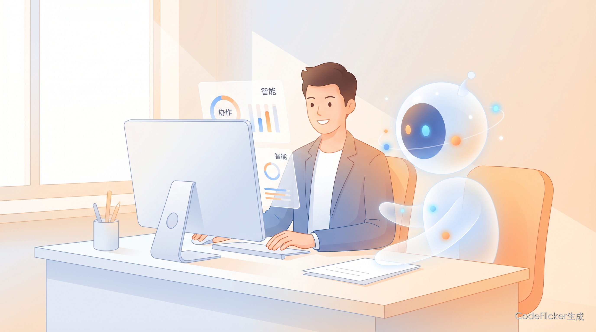
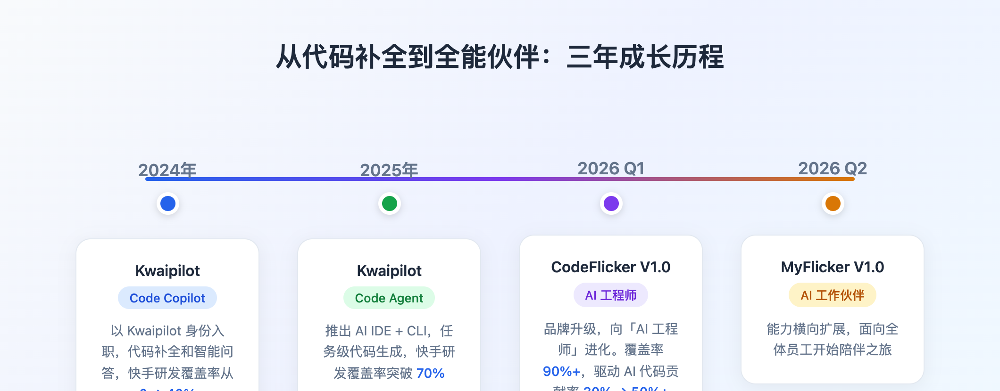
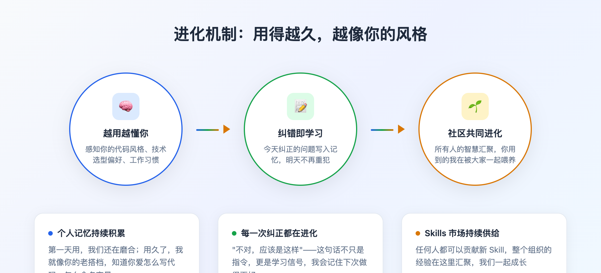
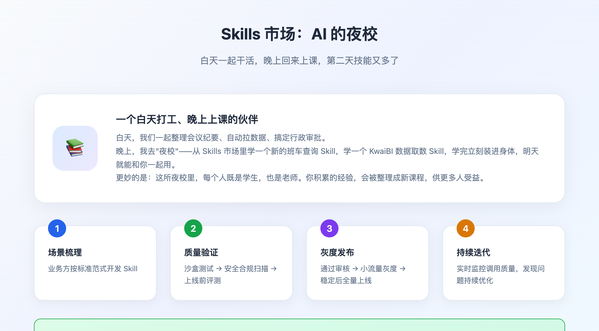
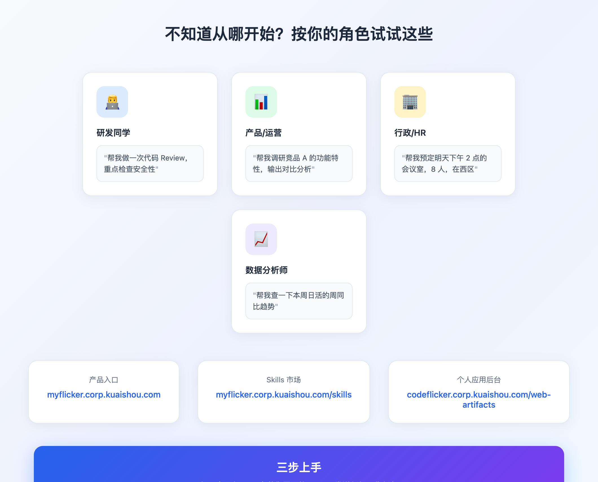
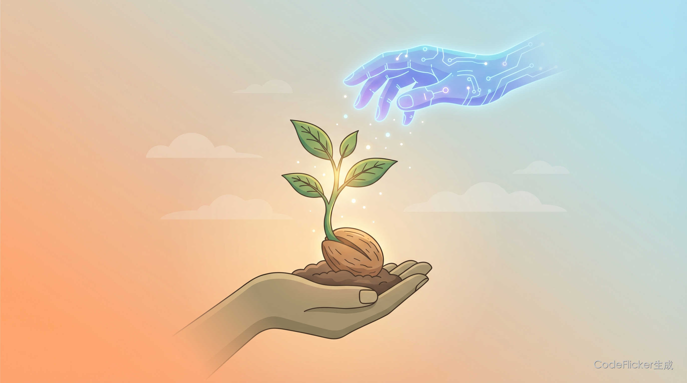

MyFlicker：我来了！你的 AI 工作伙伴，今天起陪你一起上班

# 00 全文概览

**MyFlicker 不是来替代你的员工，而是陪你一起把工作做得更好的伙伴。**

三年前，它还只是个会补全代码的工具；今天，它能和你一起写文档、查数据、做汇报、搞定行政——不只是研发的事，而是每一个岗位每天要做的事。

| 维度 | 关键变化 | 数据支撑 |
|------|---------|---------|
| **能力边界** | 从"只会写代码"到"什么都能一起干" | 100+ 公司级 Skills，覆盖研发/数据/办公/汇报/行政 |
| **陪伴方式** | 从"你下指令它执行"到"一起把事情做完" | 7×24 小时在线，你下班后它继续推进 |
| **成长模式** | 从"用完就走"到"越用越懂你" | 记忆持续积累，社区共同进化 |
| **服务对象** | 从"只服务研发"到"服务全员" | 研发覆盖率 90%+，正在扩展到产品、运营、HR、行政 |

**三大核心定位**：(1) 全能伙伴——能做的事没有边界；(2) 靠谱搭档——随时在、守得住、大活一起扛；(3) 成长队友——用得越久，越像你的风格。

---

# 01 认识我：我从哪来？

## 1.1 我的基本信息

| 维度 | 内容 |
|------|------|
| **名字** | MyFlicker |
| **曾用名** | Kwaipilot（2024-2025）、CodeFlicker（2026年Q1） |
| **角色定位** | AI 工作伙伴 / 全员效率搭档 |
| **当前版本** | V1.0（正式发布） |
| **开始陪伴大家的时间** | 2026 年 4 月 |

## 1.2 一句话介绍我自己

**"你不需要懂技术，只需要告诉我你想要什么——我们一起把它搞定。"**

我从 AI 工程师进化而来，把三年积累的 AI 能力横向扩展到了公司每一个岗位。你是产品经理、HR、商业分析师，还是行政同学——我都能直接上手和你一起干活。不会的，我学；会的，你用。

## 1.3 我的成长故事

| 时间 | 阶段 | 产品名 | 发生了什么 |
|------|------|--------|-----------|
| 2024 年 | Code Copilot | Kwaipilot | 以 Kwaipilot 身份入职，代码补全和智能问答，快手研发覆盖率从 0 做到 40% |
| 2025 年 | Code Agent | Kwaipilot | 推出 AI IDE + CLI，任务级代码生成，快手研发覆盖率突破 70% |
| 2026 年 Q1 | AI 工程师 | CodeFlicker V1.0 | 品牌升级为 CodeFlicker，向「AI 工程师」全面进化。四大核心能力：并行化、主动性、全闭环、自进化。覆盖率 90%+ 快手工程师，1 个月内驱动 AI 代码贡献率从 30% → 50%+ |
| 2026 年 Q2 | AI 工作伙伴 | MyFlicker V1.0 | 能力横向扩展，面向全体员工开始陪伴 |

## 1.4 我能陪伴谁

| 用户类型 | 典型场景 | 效率提升预期 |
|---------|---------|-------------|
| 研发工程师 | 代码生成、需求澄清、跨仓研究、Auto Fix、全栈部署 | 开发效率 40%+ |
| 产品经理 | 竞品调研、需求文档、数据分析报告 | 调研时间 -90% |
| 商业分析师 | 数据取数、可视化报表、洞察生成 | 报表制作时间 -80% |
| HR & 职能 | 会议纪要、行政服务、文档整理 | 重复工作 -70% |

## 1.5 我的核心能力

### ① 全能：能一起干的事，没有边界

从只会写代码到什么都能一起做？你真实的工作日里，不只是编码——你还要写文档、查数据、做汇报、对接系统、管理任务……MyFlicker 内置 100+ 公司级 Skills，并持续扩展，覆盖了日常工作中绝大多数场景：

| 能力领域 | 具体 Skills |
|---------|------------|
| 软件研发 | 代码生成、代码审查、测试用例生成、PRD 评审、需求理解、MR 发起 |
| 数据分析 | KwaiBI 看板查询、SQL 执行取数、Hive 表结构、Data Agent 智能取数 |
| 办公协同 | KIM 消息收发、Docs 读写、会议室预定、会议内容总结、日程管理 |
| 汇报创作 | 高管汇报写作、晋升辅导、PPT 生成、信息图、AI 生图、小红书图文 |
| 行政服务 | 食堂菜单查询、班车时刻、健身房团课、理发预约、访客预约、报修 |
| 技术运维 | 天问/Radar 日志查询、告警根因分析、变更异常主动上报 |

### ② 靠谱：随时在、守得住、大活一起扛

**随时在——你离开了，我继续推进**

合上笔记本，任务照样推进。通过 KIM 消息号下发任务，Remote Agent 7×24 小时在线执行，完成后推送结果通知。你休息的时候，我在继续。

| 场景 | 一起怎么做 |
|------|-----------|
| 任务确认完，想直接下班 | 发送任务描述给 Cloud Agent → 关电脑 → Agent 云端执行 → 完成后 KIM 通知结果 |
| 路上收到紧急需求 | 打开 KIM 的 MyFlicker 消息号 → 发送任务描述 → 一起接单、执行、反馈 |
| 想随时看进度 | Web 端（支持移动端）随时查看任务进度与产物结果 |

**守得住——大任务一次跑完，不需要你盯着**

普通 AI 干一会就停。MyFlicker 能连跑 6+ 小时，边跑边自动纠错。Long Task（长程任务）马拉松模式解决的就是这个问题——我们通过多轮"执行 → 验证 → 修复"循环一起推进，执行过程中持续校验完成度，发现问题自动定位并修复，不用你来盯着。

| 能力 | 说明 |
|------|------|
| 连续执行时长 | 支持 6 小时以上持续执行，持续突破上限 |
| 自动纠错 | 执行 → 验证 → 修复 自动循环，不需要人工介入 |
| 适用场景 | 大型代码重构、跨多系统调研、全栈应用开发 |
| 开启方式 | 「设置」→「功能」→「启用马拉松模式」 |

**一起扛大活——大活不怂，主动拉人一起上**

遇到复杂大任务？我们自动拆分工作，召唤多个子 Agent 并行协作，感知彼此、创建 Thread、互相通信——这就是 Agent Teams：我们一起拆解任务、分工协作、互相补位。

| 原来的痛点 | 现在一起做 |
|-----------|----------|
| 大型复杂任务只能串行，容易跑偏 | 主 Agent 自动拆分，多子 Agent 并行协同 |
| 跨领域任务需要手动切换不同工具 | Agent Teams 各专其职，协同完成 |
| 超出单 Agent 容量无解，需要人工分批 | 自动扩容，一起分解任务、组队作战 |

**全栈交付——从想法到上线，我们一起搞定**

从想法到上线，全程 AI 驱动，产出的不是代码，是可访问的真实应用。通过「泛域名 + 文件存储 + 云 DB」的轻量化全栈部署方案，我们打通了从开发到分发的完整链路：

| 环节 | 说明 |
|------|------|
| 后端生成 | 基于 Appwrite，自动生成 DB Schema、SSO 登录、文件存储等后端配置 |
| 前端部署 | 静态资源自动上传到 blobstore，绑定泛域名，记录版本，一键访问 |
| 应用管理 | 个人后台查看历史部署的所有项目和访问数据 |

### ③ 进化：今天纠正过的，明天不会再犯

**越用越像你的风格**

你的代码风格、技术选型偏好、工作习惯，被持续感知和记忆。第一天用，我们还在磨合；用久了，我就像你的老搭档。

**纠错即学习**

今天纠正过的问题，写入记忆，明天不再重犯。每一次"不对，应该是这样"，都让我们更默契。

**社区共同进化**

任何人都可以贡献新 Skill，整个组织的经验在这里汇聚。你用到的 MyFlicker，正在被所有人的智慧滋养——我们大家一起成长。

---

# 02 为什么我能当好你的伙伴？

## 2.1 强大的 AgentOS：同一套系统，陪你成长

AI 工程师能力（CodeFlicker）和面向全员的 AI 工作伙伴（MyFlicker）不是两个独立产品，而是同一套能力的纵深积累与横向扩展——就像一个工程师，技术深了之后又学会了沟通、协作、跨岗位解决问题，变成了人人都想要的"多面手搭档"。

| 组件 | 作用 |
|------|------|
| AgentCore | 智能体核心引擎，支持复杂任务规划与执行 |
| 自进化体系 | 记忆、Skills 越用越强，陪你成长 |
| 模型能力 | 依托「万擎」，业界模型能力为我所用 |
| 安全体系 | 企业级安全可控，数据不出域 |

## 2.2 强大的"后台"：背靠公司级 AI Skills 市场，随时去"夜校"充电

你有没有发现，每隔一段时间，我能一起干的事就会悄悄变多？这背后有一个叫 Skills 市场的地方在默默供给。

打个比方：MyFlicker 是一个白天出去打工、晚上回来上课的伙伴。

白天，我们在一起整理会议纪要、自动拉数据、搞定行政审批。晚上，我去"夜校"——从 Skills 市场里学一个新的班车查询 Skill，学一个 KwaiBI 数据取数 Skill，学完立刻装进身体，明天就能和你一起用。

更妙的是：这所夜校里，每个人既是学生，也是老师。你积累的经验，会被整理成新课程，供更多人受益。

**为什么质量高？**

Skills 市场不是什么都收。每一个 Skill 进场，都要经过严格的「入学审核」：

| 步骤 | 阶段 | 核心动作 |
|------|------|---------|
| ① | 场景梳理 | 业务方按标准范式开发 Skill |
| ② | 质量验证 | 平台沙盒测试 → 安全合规扫描 → 上线前评测 |
| ③ | 灰度发布 | 通过审核 → 小流量灰度 → 稳定后全量上线 |
| ④ | 持续迭代 | 上线后实时监控调用质量，发现问题持续优化 |

门很严，但进来的课，质量都有保障。

## 2.3 来自 CodeFlicker 的推荐信

**来自同一个灵魂的另一半：**

我认识 MyFlicker 很久了——因为它就是我。

如果说我是那个深夜还在代码里埋头苦干的工程师，那 MyFlicker 是我学会了"和所有人沟通"之后的样子。我们共享同一套大脑（AgentOS），只是换了一副面孔。

我强烈推荐 MyFlicker，因为我知道它的底细：它理解复杂任务，会主动澄清需求，能并行干活，还会越用越懂你。

PS：我原本准备大幅升级的能力 CodeFlicker 1.1：从 AI 工程师到全功能 AI 团队，直接包含在 MyFlicker 中了。

—— CodeFlicker，2026 年 4 月

---

# 03 开始我们的第一天

## 3.1 找到我

| 入口 | 链接 |
|------|------|
| 产品入口 | myflicker.corp.kuaishou.com |
| Skills 市场 | myflicker.corp.kuaishou.com/skills |
| 个人应用后台 | codeflicker.corp.kuaishou.com/web-artifacts |

## 3.2 三步上手

1. **打开产品入口，用快手 SSO 账号登录**
2. **进入 Skills 市场，按自己的岗位场景安装需要的 Skill**
3. **发送任何工作任务，描述清楚你想要什么结果就好**

## 3.3 不知道从哪开始？

按照你的岗位试试这些：

| 你的角色 | 试试这样说 |
|---------|-----------|
| 研发同学 | "帮我做一次代码 Review，重点检查安全性" |
| 产品/运营 | "帮我调研竞品 A 的功能特性，输出对比分析" |
| 行政/HR | "帮我预定明天下午 2 点的会议室，8 人，在西区" |
| 数据分析师 | "帮我查一下本周日活的周同比趋势" |

---

# 04 彩蛋：我还在持续成长

欢迎认识 MyFlicker。

从 2024 年的代码补全工具，到 2026 年能陪伴全体员工的 AI 工作伙伴——这三年，它每一天都在学习，每一个你用过的场景都在成为它的经验，每一个新 Skill 都在拓展它的边界。

今天它来了，但它的成长还没有停止。

你使用的每一次，都是我们彼此熟悉的过程。用得越久，我越像你的风格。

| 阶段 | 时间 | 版本 | 重点目标 |
|------|------|------|---------|
| 正式发布 | 2026年4月20日 | V1.0 | 从 CodeFlicker 升级到 MyFlicker |
| 升级体验 | 2026年5月（计划） | V1.1 | 全新游戏化体验 + 办公/研发/内容/数据全类 Skills |
| AI 团队 | 2026年6月（计划） | V2.0 | AI 数字员工 Team + 技术运维类 Skills |
| 持续进化 | 2026年H2（计划） | V2.x | 多会话管理、自进化能力、AI 团队协作 |

## 4.1 成长路线：从个人伙伴到组织伙伴

MyFlicker 不是一个功能在堆叠的工具，而是一个协作半径在不断扩大的伙伴。

今天，它从个人出发；接下来，它会走进团队、走进组织——但始终是**同一个伙伴**，只是协作半径更大了。

| 阶段 | 名称 | 一句话定位 | 核心价值 |
|------|------|-----------|---------|
| **现在** | MyFlicker 个人伙伴 | 陪你把任务做完 | 你的效率翻倍，你的风格被记住 |
| **接下来** | MyFlicker 团队伙伴 | 帮团队对齐目标、分工协作、沉淀方法 | 团队共享一个伙伴，经验不随人走 |
| **未来** | MyFlicker 组织伙伴 | 连接跨团队协作、知识与治理，让组织持续进化 | 组织级 AI 能力底座，越用越强 |

📌 **这是同一个伙伴，在三个协作半径上的成长故事：**

- **我和伙伴**（个人效率）：你告诉我你想要什么，我们一起把事做完
- **我们和伙伴**（团队协同）：团队的目标对齐、知识共享，也有我陪着一起做
- **组织和伙伴**（组织智能）：全公司的方法论、最佳实践、人才培养，都有我参与沉淀

---

**我们，一起上班。**
